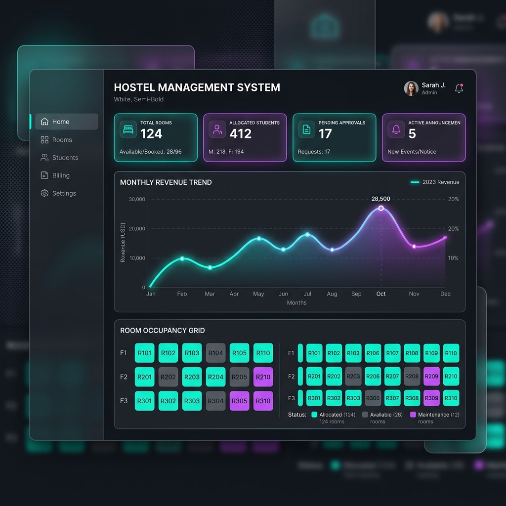
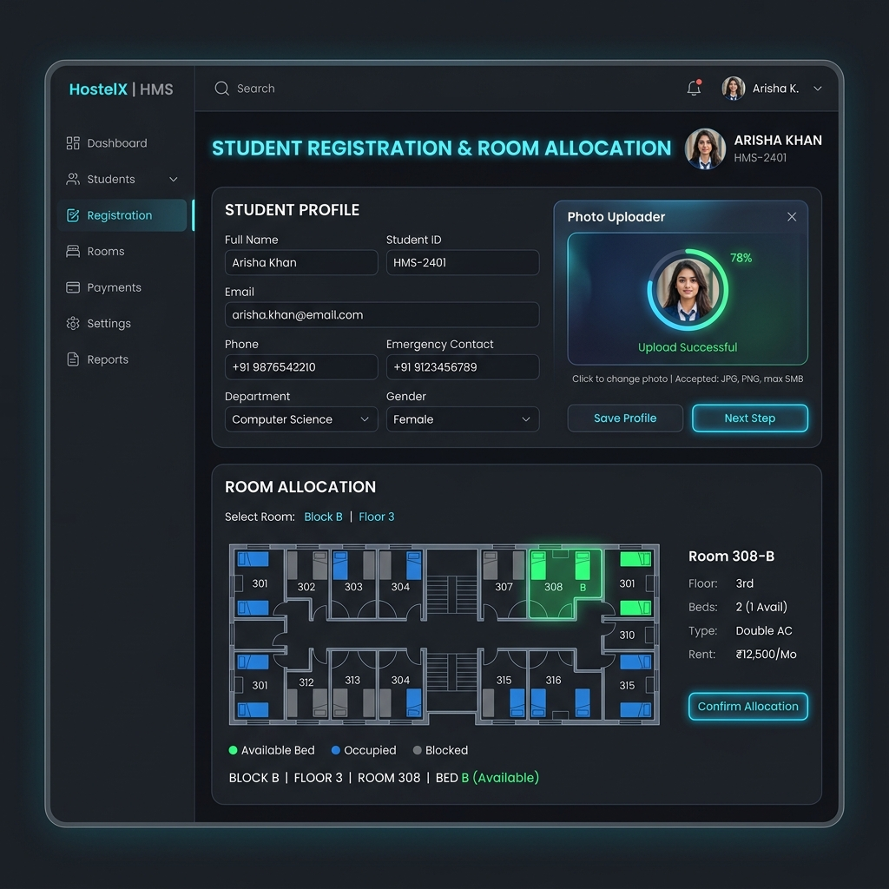
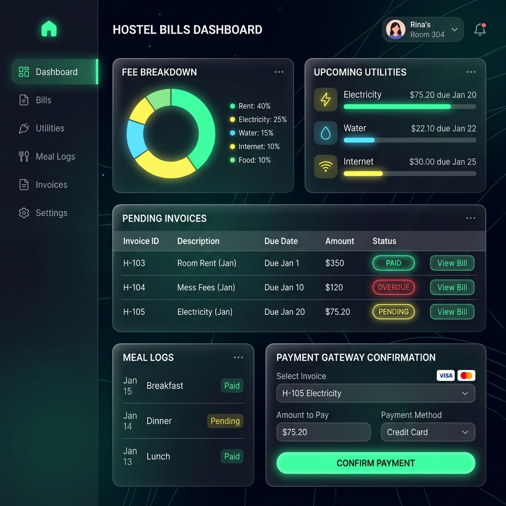

# 🏨 Hostel Management System (HMS)

<p align="center">
  
</p>

<p align="center">
  <a href="LICENSE"></a>
  <a href="https://www.php.net/"></a>
  <a href="https://www.mysql.com/"></a>
</p>

---

## 📖 Introduction

**Hostel Management System (HMS)** is a comprehensive, multi-role web application built with PHP and MySQL to streamline hostel operations. It simplifies managing student allocations, billing, payments, notices, and resource configuration across three user levels: **Administrators**, **Employees**, and **Students**.

---

## 🌟 Key Features & Visual Preview

### 1. 👤 Role-Based Portals & Dashboard
*   **Administrator Portal**: Complete system configuration, student admissions, user/employee management, billing setup, and financial approvals.
*   **Employee Portal**: Handle daily operations, billing entry, and notice updates.
*   **Student Portal**: View individual room details, billing history, notices, and payment submissions.

<p align="center">
  
</p>

### 2. 🏢 Hostel Setup & Student Admissions
*   **Block & Room Management**: Easily configure hostel blocks (buildings) and room capacities.
*   **Admission System**: Smooth workflow for registering new student profiles, assigning rooms, and uploading profile photos.
*   **Security Settings**: Secure password hashing (`md5` base) and custom user account generation.

<p align="center">
  
</p>

### 3. 💰 Financials, Billing & Payment Tracking
*   **Flexible Fee Setup**: Configure base accommodation fees, utility charges, and meal rates.
*   **Daily Meal & Cost Tracking**: Keep record of individual student meal counts and daily expense logs.
*   **Automated Billing**: Compile monthly utility/meal bills automatically.
*   **Payment Approvals**: Process, log, and approve student fee deposits online/offline.

<p align="center">
  
</p>

---

## 🛠️ Technology Stack

| Component | Technology | Description |
| :--- | :--- | :--- |
| **Backend** | PHP | Core server-side application logic |
| **Database** | MySQL | Data persistence for students, rooms, notices, and billing |
| **Frontend** | HTML5, CSS3, ES6 JS | Structure, design, and user interactivity |
| **UI Framework** | Bootstrap 3 (sb-admin-2) | Responsive admin dashboard template |
| **Libraries** | jQuery, Morris.js, Raphael.js | Dynamic charting, DOM manipulation, and calendar utilities |

---

## 🚀 Installation & Setup Guide

### Prerequisites
*   Web server environment: **XAMPP / WAMP / MAMP** (Requires a PHP environment with `mysql` extension enabled).

### Step-by-Step Installation

1.  **Clone the Repository**:
    ```bash
    git clone https://github.com/vijaymahes9080/Hostel-Management-System-Project_php.git
    ```

2.  **Move to Server Directory**:
    Place the project folder inside your web server's root directory (e.g., `C:/xampp/htdocs/hms/`).

3.  **Database Setup**:
    *   Start Apache and MySQL from your XAMPP Control Panel.
    *   Open your browser and navigate to `http://localhost/phpmyadmin/`.
    *   Create a new database named `hms`.
    *   Import the database schema file [hms.sql](hms.sql) located in the project root.

4.  **Configuration**:
    *   Open [inc/dbPlayer.php](inc/dbPlayer.php) to verify the database credentials:
        ```php
        private $db_host="localhost";
        private $db_name="hms";
        private $db_user="root"; // Your MySQL Username
        private $db_pass="";     // Your MySQL Password
        ```
    *   Open [footer.php](footer.php) and ensure `$base_url` points to your project path:
        ```php
        $base_url="http://localhost/hms/";
        ```

5.  **Run the Application**:
    *   Open your browser and navigate to `http://localhost/hms/index.php`.

---

## 🔑 Default Login Credentials

Use the following credentials to access the portals:

*   **Administrator**:
    *   **Username**: `admin`
    *   **Password**: `password`
*   **Student (Demo)**:
    *   **Username/Email**: `rasel@gmail.com`
    *   **Password**: `password` (or check database values inside the `users` table)

---

## 🔒 Security Notice

> [!WARNING]
> This application is built as a student learning project and utilizes the legacy PHP `mysql_*` extension. It does not include advanced password hashing (uses MD5) or robust SQL injection prevention, making it vulnerable in production environments.
> **Please do not deploy this application on public production servers without refactoring it to PDO / MySQLi.**

---

## 📄 License

Distributed under the **MIT License**. See the [LICENSE](LICENSE) file for more details.

---

## 📬 Contact & Support

*   **Maintainer**: Vijay Mahes
*   **GitHub**: [@vijaymahes9080](https://github.com/vijaymahes9080)
*   **Email**: [vijaymahes9080@gmail.com](mailto:vijaymahes9080@gmail.com)

If you need any help running the project, feel free to open an issue or reach out via email!